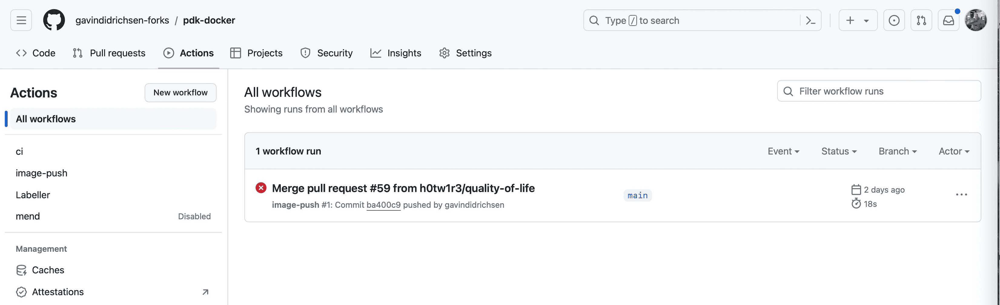
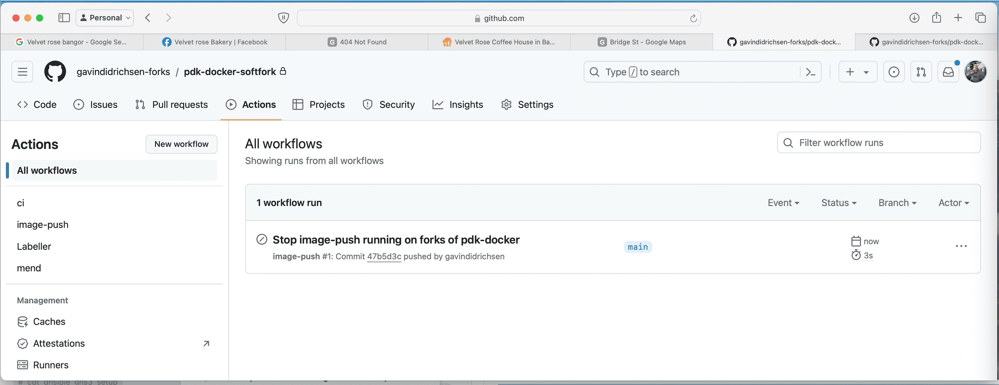

# 1. To prevent forks from running the image-push workflow

Date: 2024-05-18

## Status

Accepted

## Context

During recent work on the `puppetlabs/pdk-docker` github actions, I created a fork to test out the image push and unexpectedly--after enabling actions--discovered that it was running the ``image-push.yml`` workflow.  Fortunately because my fork did not contain any of the actual secrets, the workflow failed and did not cause any harm pushing up any images.  

Nevertheless, I wanted to add a further precaution to this workflow.

## Decision

Therefore, I decided to add a conditional to `jobs:` section of the `image-push` workflow so that the steps will always be aborted unless the repository is `puppetlabs/pdk-docker`.  Unfortunately, there is no way to conditionally check the "on:" so I had to add a conditional beneath the "jobs:".

## Consequences

Although the above implementation cannot stop the `image-push` from being triggered on a fork, it will prevent the job's steps from proceeding.  Even if the fork contained the actual credential for pushing to puppetlabs docker hub, then this conditional statement in the `jobs:` will prevent an accidental push.  As intended this adds an extra layer of security preventing an accidental docker image push.

For example, see below on my fork.  Now the `image-push` has aborted:

